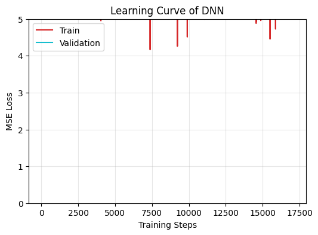
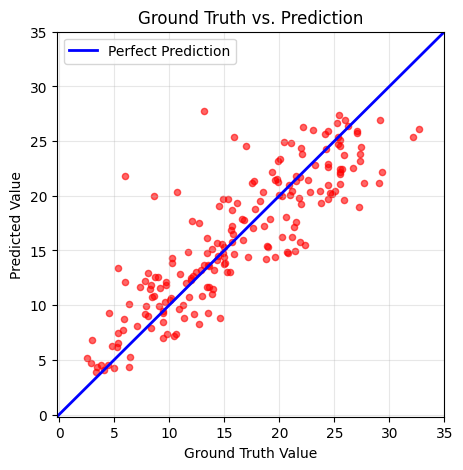
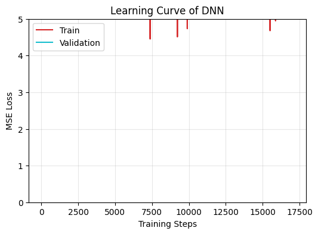
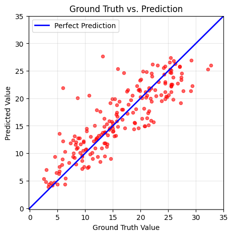
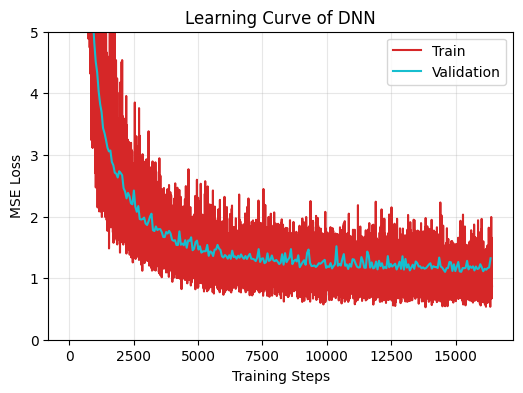
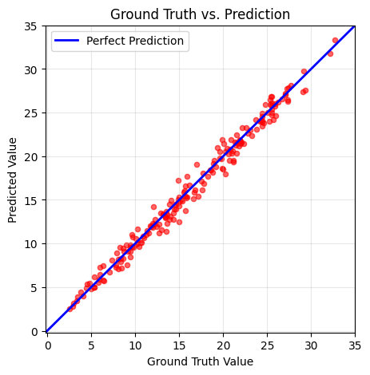
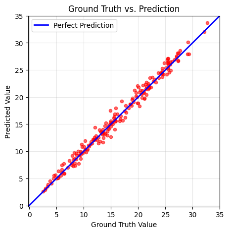

## TODO2
``` bash
Saving model (epoch =    1, loss = 256.1671)
Saving model (epoch =    2, loss = 201.6471)
Saving model (epoch =    3, loss = 162.1958)
Saving model (epoch =    4, loss = 133.6850)
Saving model (epoch =    5, loss = 113.0534)
Saving model (epoch =    6, loss = 98.0820)
Saving model (epoch =    7, loss = 87.2278)
Saving model (epoch =    8, loss = 79.3668)
Saving model (epoch =    9, loss = 73.6380)
Saving model (epoch =   10, loss = 69.4369)
Saving model (epoch =   11, loss = 66.3197)
Saving model (epoch =   12, loss = 63.9880)
Saving model (epoch =   13, loss = 62.1011)
Saving model (epoch =   14, loss = 60.5093)
Saving model (epoch =   15, loss = 58.8816)
Saving model (epoch =   16, loss = 56.7079)
Saving model (epoch =   17, loss = 52.9987)
Saving model (epoch =   18, loss = 46.7110)
Saving model (epoch =   19, loss = 40.4960)
Saving model (epoch =   20, loss = 36.4435)
Saving model (epoch =   21, loss = 33.8082)
Saving model (epoch =   22, loss = 32.3029)
Saving model (epoch =   23, loss = 30.1858)
Saving model (epoch =   24, loss = 29.2562)
Saving model (epoch =   25, loss = 27.6728)
Saving model (epoch =   26, loss = 27.3298)
Saving model (epoch =   27, loss = 25.5141)
Saving model (epoch =   28, loss = 24.6586)
Saving model (epoch =   29, loss = 23.9388)
Saving model (epoch =   30, loss = 23.6079)
Saving model (epoch =   31, loss = 22.6703)
Saving model (epoch =   32, loss = 22.2034)
Saving model (epoch =   33, loss = 21.6825)
Saving model (epoch =   35, loss = 21.3957)
Saving model (epoch =   36, loss = 20.6521)
Saving model (epoch =   37, loss = 20.2256)
Saving model (epoch =   38, loss = 19.9724)
Saving model (epoch =   39, loss = 19.6819)
Saving model (epoch =   43, loss = 19.2510)
Saving model (epoch =   44, loss = 18.8582)
Saving model (epoch =   45, loss = 18.6257)
Saving model (epoch =   46, loss = 18.3824)
Saving model (epoch =   47, loss = 18.2747)
Saving model (epoch =   48, loss = 18.2378)
Saving model (epoch =   49, loss = 18.0488)
Saving model (epoch =   50, loss = 17.9814)
Saving model (epoch =   51, loss = 17.8744)
Saving model (epoch =   52, loss = 17.7663)
Saving model (epoch =   54, loss = 17.7069)
Saving model (epoch =   56, loss = 17.4249)
Saving model (epoch =   61, loss = 17.2877)
Saving model (epoch =   64, loss = 17.1613)
Saving model (epoch =   65, loss = 16.9215)
Saving model (epoch =   66, loss = 16.8900)
Saving model (epoch =   71, loss = 16.7165)
Saving model (epoch =   72, loss = 16.6904)
Saving model (epoch =   75, loss = 16.5737)
Saving model (epoch =   78, loss = 16.4885)
Saving model (epoch =   79, loss = 16.4310)
Saving model (epoch =   82, loss = 16.2986)
Saving model (epoch =   83, loss = 16.2892)
Saving model (epoch =   91, loss = 16.2777)
Saving model (epoch =   92, loss = 16.0653)
Saving model (epoch =   95, loss = 16.0305)
Saving model (epoch =  101, loss = 15.9239)
Saving model (epoch =  108, loss = 15.9030)
Saving model (epoch =  116, loss = 15.8639)
Saving model (epoch =  117, loss = 15.7220)
Saving model (epoch =  123, loss = 15.6558)
Saving model (epoch =  136, loss = 15.6463)
Saving model (epoch =  148, loss = 15.6222)
Saving model (epoch =  149, loss = 15.5071)
Saving model (epoch =  168, loss = 15.4722)
Saving model (epoch =  174, loss = 15.4514)
Saving model (epoch =  181, loss = 15.4242)
Saving model (epoch =  187, loss = 15.4117)
Saving model (epoch =  191, loss = 15.3113)
Saving model (epoch =  208, loss = 15.2783)
Saving model (epoch =  211, loss = 15.2667)
Saving model (epoch =  214, loss = 15.2656)
Saving model (epoch =  215, loss = 15.2435)
Saving model (epoch =  217, loss = 15.1930)
Saving model (epoch =  219, loss = 15.1867)
Saving model (epoch =  222, loss = 15.1524)
Saving model (epoch =  227, loss = 15.1468)
Saving model (epoch =  241, loss = 15.1430)
Saving model (epoch =  246, loss = 15.1416)
Saving model (epoch =  247, loss = 15.0808)
Saving model (epoch =  255, loss = 15.0533)
Saving model (epoch =  276, loss = 14.9873)
Saving model (epoch =  293, loss = 14.9830)
Finished training after 300 epochs
```





## TODO3
添加L2正则化
``` bash
Saving model (epoch =    1, loss = 256.2684)
Saving model (epoch =    2, loss = 201.7481)
Saving model (epoch =    3, loss = 162.2964)
Saving model (epoch =    4, loss = 133.7850)
Saving model (epoch =    5, loss = 113.1506)
Saving model (epoch =    6, loss = 98.1769)
Saving model (epoch =    7, loss = 87.3263)
Saving model (epoch =    8, loss = 79.4673)
Saving model (epoch =    9, loss = 73.7412)
Saving model (epoch =   10, loss = 69.5443)
Saving model (epoch =   11, loss = 66.4345)
Saving model (epoch =   12, loss = 64.1189)
Saving model (epoch =   13, loss = 62.2750)
Saving model (epoch =   14, loss = 60.7446)
Saving model (epoch =   15, loss = 59.2426)
Saving model (epoch =   16, loss = 57.3495)
Saving model (epoch =   17, loss = 54.2647)
Saving model (epoch =   18, loss = 48.6413)
Saving model (epoch =   19, loss = 42.1419)
Saving model (epoch =   20, loss = 37.4937)
Saving model (epoch =   21, loss = 34.5666)
Saving model (epoch =   22, loss = 32.9123)
Saving model (epoch =   23, loss = 30.7462)
Saving model (epoch =   24, loss = 29.7627)
Saving model (epoch =   25, loss = 28.1708)
...
Saving model (epoch =  250, loss = 15.2647)
Saving model (epoch =  255, loss = 15.2374)
Saving model (epoch =  276, loss = 15.1754)
Finished training after 300 epochs
```






## TODO4
修改优化器为Adam
``` bash
Saving model (epoch =    1, loss = 256.2684)
Saving model (epoch =    2, loss = 201.7481)
Saving model (epoch =    3, loss = 162.2964)
Saving model (epoch =    4, loss = 133.7850)
Saving model (epoch =    5, loss = 113.1506)
Saving model (epoch =    6, loss = 98.1769)
Saving model (epoch =    7, loss = 87.3263)
Saving model (epoch =    8, loss = 79.4673)
Saving model (epoch =    9, loss = 73.7412)
Saving model (epoch =   10, loss = 69.5443)
Saving model (epoch =   11, loss = 66.4345)
Saving model (epoch =   12, loss = 64.1189)
Saving model (epoch =   13, loss = 62.2750)
Saving model (epoch =   14, loss = 60.7446)
Saving model (epoch =   15, loss = 59.2426)
Saving model (epoch =   16, loss = 57.3495)
Saving model (epoch =   17, loss = 54.2647)
Saving model (epoch =   18, loss = 48.6413)
Saving model (epoch =   19, loss = 42.1419)
Saving model (epoch =   20, loss = 37.4937)
Saving model (epoch =   21, loss = 34.5666)
Saving model (epoch =   22, loss = 32.9123)
Saving model (epoch =   23, loss = 30.7462)
Saving model (epoch =   24, loss = 29.7627)
Saving model (epoch =   25, loss = 28.1708)
...
Saving model (epoch =  250, loss = 15.2647)
Saving model (epoch =  255, loss = 15.2374)
Saving model (epoch =  276, loss = 15.1754)
Finished training after 300 epochs
```


## 选择所有feature
``` bash
Saving model (epoch =    1, loss = 305.0297)
Saving model (epoch =    2, loss = 224.3580)
Saving model (epoch =    3, loss = 85.2939)
Saving model (epoch =    4, loss = 43.0098)
Saving model (epoch =    5, loss = 33.8280)
Saving model (epoch =    6, loss = 29.5518)
Saving model (epoch =    7, loss = 25.8868)
Saving model (epoch =    8, loss = 22.2100)
Saving model (epoch =    9, loss = 18.6390)
Saving model (epoch =   10, loss = 15.4099)
Saving model (epoch =   11, loss = 12.5724)
Saving model (epoch =   12, loss = 10.3839)
Saving model (epoch =   13, loss = 8.6047)
Saving model (epoch =   14, loss = 7.5039)
Saving model (epoch =   15, loss = 6.4591)
Saving model (epoch =   16, loss = 5.7559)
Saving model (epoch =   17, loss = 5.2662)
Saving model (epoch =   18, loss = 4.8326)
Saving model (epoch =   19, loss = 4.5160)
Saving model (epoch =   20, loss = 4.3385)
Saving model (epoch =   21, loss = 4.0345)
Saving model (epoch =   22, loss = 3.8283)
Saving model (epoch =   23, loss = 3.6968)
Saving model (epoch =   24, loss = 3.4359)
Saving model (epoch =   25, loss = 3.3550)
...
Saving model (epoch =  229, loss = 1.1381)
Saving model (epoch =  233, loss = 1.1254)
Saving model (epoch =  257, loss = 1.1020)
Finished training after 288 epochs
Output is truncated. View as a scrollable element or open in a text editor. Adjust cell output settings...
```





## 修复归一化问题
修复了训练集和测试集归一化不一致的问题，使用训练集的统计参数归一化所有数据。

``` bash
Saving model (epoch =    1, loss = 304.2666)
Saving model (epoch =    2, loss = 221.1426)
Saving model (epoch =    3, loss = 81.4772)
Saving model (epoch =    4, loss = 42.1778)
Saving model (epoch =    5, loss = 32.5842)
Saving model (epoch =    6, loss = 28.3222)
Saving model (epoch =    7, loss = 24.9042)
Saving model (epoch =    8, loss = 21.0691)
Saving model (epoch =    9, loss = 17.9989)
Saving model (epoch =   10, loss = 14.6672)
Saving model (epoch =   11, loss = 11.8173)
Saving model (epoch =   12, loss = 9.7098)
Saving model (epoch =   13, loss = 8.1607)
Saving model (epoch =   14, loss = 6.9920)
Saving model (epoch =   15, loss = 6.2153)
Saving model (epoch =   16, loss = 5.5625)
Saving model (epoch =   17, loss = 5.0484)
Saving model (epoch =   18, loss = 4.7694)
Saving model (epoch =   19, loss = 4.4079)
Saving model (epoch =   20, loss = 4.1499)
Saving model (epoch =   21, loss = 3.9293)
Saving model (epoch =   22, loss = 3.6853)
Saving model (epoch =   23, loss = 3.5321)
Saving model (epoch =   24, loss = 3.4414)
Saving model (epoch =   25, loss = 3.3705)
...
Saving model (epoch =  239, loss = 1.1014)
Saving model (epoch =  248, loss = 1.0949)
Saving model (epoch =  257, loss = 1.0920)
Finished training after 288 epochs
Output is truncated. View as a scrollable element or open in a text editor. Adjust cell output settings...
```




**效果对比：**
- 修复前预测范围：142-210（明显异常）
- 修复后预测范围：12-20（正常范围，与目标值2-41一致）
- 问题根源：训练集和测试集使用了不同的归一化参数